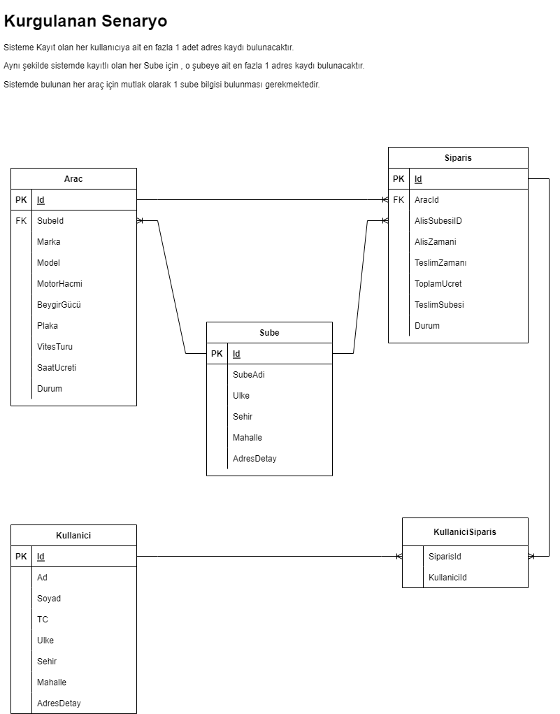

## Okunabilir API Tasarýmý
* Api tasarýmlarýnda dikkat edilmesi gereken noktalarýn baþýnda endpoint ismlerinde aksiyon ifadelerinden kaçýnýlmalýdýr.
* Api tasarýmýnda kaynaklar(resource) çoðul tanýmlanmalýdýr.

//include theninclude
---
* https://learn.microsoft.com/en-us/aspnet/web-api/overview/web-api-routing-and-actions/attribute-routing-in-web-api-2

